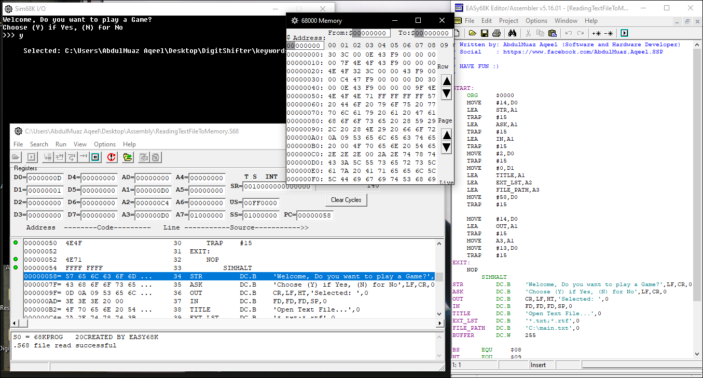

# EASy68k-Assembly-WrittenFiles
A few assembly example files written using the simulator EASy68K - it's another funny way to play around the assembly and memory stuff.

## Download!
You can find it available free on the Google and easily download it by visiting this link
<a href="http://www.easy68k.com/"> EASy68K Home Page <a>
 
once you download it.. you can now play games....... :D
 
I'm kidding, not literally games but it's so easy to write, debug and execute the code and with a lot of built-in examples in the HELP section
 
and here below is a screenshot of my code I wrote it few weeks ago.
 

  

 

## Test Assembly Files
You can download the files right above and test them out easily.. or you can write your own code with the HELP section in the toolbar in the program (Simulator)

## HAVE FUN :D
